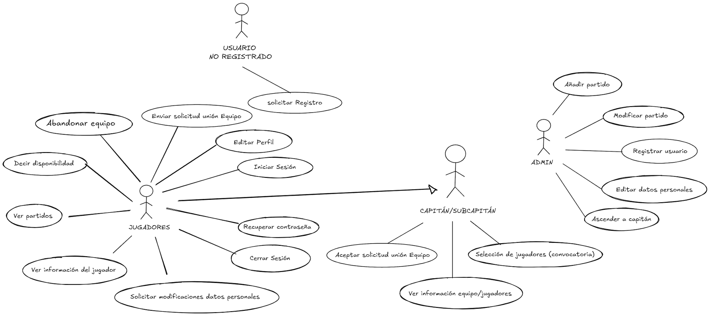

# Proyecto Padel

## Escenario del proyecto

El proyecto 'Proyecto Padel' es una aplicación web destinada a facilitar la organización de partidos entre jugadores de pádel. A través de esta plataforma, los usuarios podrán registrarse, crear partidos, gestionar su disponibilidad y coordinar encuentros de manera eficiente.

El sistema permitirá a los jugadores organizar partidos según su disponibilidad, invitando a otros usuarios registrados o buscando compañeros de juego. Además, se incluirá un sistema de gestión de equipos, donde los usuarios podrán formar grupos recurrentes para participar en encuentros organizados.

Hasta ahora, la organización de partidos y la coordinación entre jugadores se realizaba mediante aplicaciones de mensajería y hojas de cálculo compartidas. Sin embargo, este proceso suele ser poco eficiente y generar confusión entre los participantes. Con esta nueva aplicación, se busca centralizar la gestión de los partidos en una plataforma intuitiva y fácil de usar.

## Casos de uso

